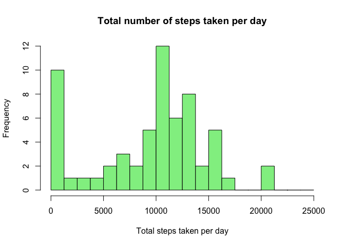

## Loading and preprocessing the data


```r
unzip_data <- unzip("activity.zip")
activity <- read.csv(unzip_data)
summary(activity)
```

```
##      steps            date              interval     
##  Min.   :  0.00   Length:17568       Min.   :   0.0  
##  1st Qu.:  0.00   Class :character   1st Qu.: 588.8  
##  Median :  0.00   Mode  :character   Median :1177.5  
##  Mean   : 37.38                      Mean   :1177.5  
##  3rd Qu.: 12.00                      3rd Qu.:1766.2  
##  Max.   :806.00                      Max.   :2355.0  
##  NA's   :2304
```

```r
# transforming the date column into date format using lubridate
library(lubridate)
```

```
## 
## Attaching package: 'lubridate'
```

```
## The following objects are masked from 'package:base':
## 
##     date, intersect, setdiff, union
```

```r
activity$date <- ymd(activity$date)
```

## What is mean total number of steps taken per day?

```r
# create a table "number of steps taken per day"
total_steps <- with(activity, aggregate(activity$steps, by = list(activity$date), FUN = sum, na.rm = TRUE))
names(total_steps) <- c("date", "steps")
# create the histogram
hist(total_steps$steps, main = "Total number of steps taken per day", xlab = "Total steps taken per day", col = "lightgreen", breaks = seq(0,25000,by=1250))
```

<!-- -->
The *mean* of the total number of steps taken per day:


```r
mean(total_steps$steps)
```

```
## [1] 9354.23
```

The *median* of the total number of steps taken per day:


```r
median(total_steps$steps)
```

```
## [1] 10395
```


## What is the average daily activity pattern?


```r
average_number_steps <- aggregate(activity$steps, by=list(activity$interval), FUN=mean, na.rm=TRUE)
names(average_number_steps) <- c("interval", "mean")
plot(average_number_steps$interval, average_number_steps$mean, type = "l", col="green", lwd = 2, xlab="Interval", ylab="Average number of steps", main="Average number of steps per intervals")
```

<!-- -->
The 5-minute interval that, on average, contains the maximum number of steps


```r
average_number_steps[which.max(average_number_steps$mean), ]$interval
```

```
## [1] 835
```

## Imputing missing values

```r
imputed_steps <- average_number_steps$mean[match(activity$interval, average_number_steps$interval)]
```

Create a new dataset that is equal to the original dataset but with the missing data filled in.


```r
activity_imputed <- transform(activity, steps = ifelse(is.na(activity$steps), yes = imputed_steps, no = activity$steps))
total_steps_imputed <- aggregate(steps ~ date, activity_imputed, sum)
names(total_steps_imputed) <- c("date", "daily_steps")
```
Create a histogram of the total number of steps taken each day

```r
hist(total_steps_imputed$daily_steps, col = "lightblue", xlab = "Total steps per day", main = "Total number of steps taken each day", breaks = seq(0,25000,by=1250))
```

<!-- -->
The mean of the total number of steps taken per day:

```r
mean(total_steps_imputed$daily_steps)
```

```
## [1] 10766.19
```

The median of the total number of steps taken per day:


```r
median(total_steps_imputed$daily_steps)
```

```
## [1] 10766.19
```

Imputing missing data have only a little and transcurable impact on the mean ant the median of the total daily number of steps. Watching the histogram we can note than the only bin that is changed is the interval between 0 and 1250 steps. Different methods for replace missing values could cause different results.

## Are there differences in activity patterns between weekdays and weekends?

1. Create a new factor variable in the dataset with two levels - “weekday” and “weekend” indicating whether a given date is a weekday or weekend day.
*DayType* is the new column indicating if the day is a weekday day or a weekend day: the first ten values of the new table are shown below


```r
# create a variable with weekdays name
activity_imputed$weekday <- weekdays(activity_imputed$date)
# create a new variable indicating weekday or weekend
activity_imputed$day_type <- ifelse(activity_imputed$weekday=='Saturday' | activity_imputed$weekday=='Sunday', 'weekend','weekday')
```

2. Two time series plot of the 5-minute interval (x) and the average number of steps taken averaged across weekday days or weekend days (y).


```r
# create table with steps per time across weekdaydays or weekend days
steps_day_type <- aggregate(steps~interval+day_type, activity_imputed, mean, na.rm = TRUE)
# variable time (more comprensible for the graph axis)
steps_day_type$time <- steps_day_type$interval/100
# create the line plot
library(ggplot2)
plot<- ggplot(steps_day_type, aes(x = interval , y = steps, color = day_type)) +
       geom_line() +
       labs(title = "Average daily steps by type of date", x = "Interval", y = "Average number of steps") +
       facet_wrap(~day_type, ncol = 1, nrow=2)
print(plot)
```

<!-- -->
